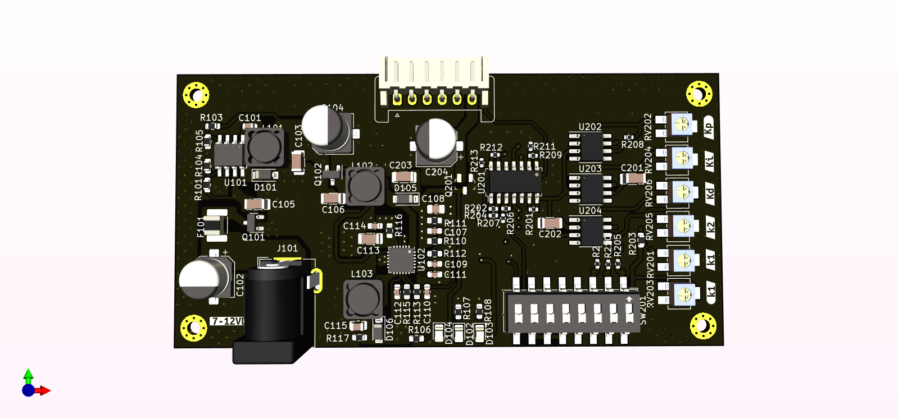
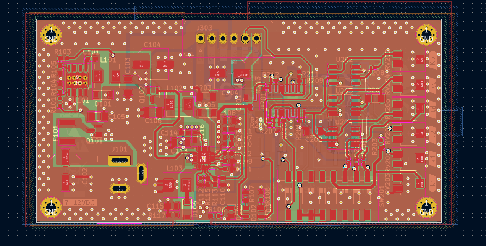
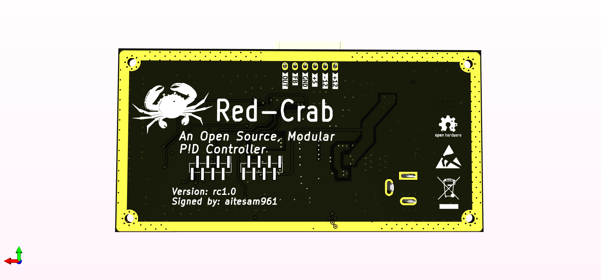

# Red-Crab: An Open Source, Modular PID controller.
RED-CRAB is an Open Source PID Controller designed for easy and flexible prototyping with PID controllers.
Offering vast selection of control parameters, this Project could be implemented in applications from hobbyist projects to home devices to industrial equipment where closed loop systems are required.

The idea of this project is to use a modular approach where different ad-ons could be used with the Basic PID controller board for controlling applications. Add-on Boards will be designed next added to the repository.
(OSHW Community can contribute in designing add-ons).

## Preview
<p align="center">
  
</p>
<p align="right">
  
</p>
<p align="left">
  
</p>


## Table of contents
* [Red-Crab Overview](https://github.com/aitesam961/Red-Crab/blob/main/README.md#red-crab-overview)
* [How to Use:](https://github.com/aitesam961/Red-Crab/blob/main/README.md#how-to-use)
* [Electrical Specifications](https://github.com/aitesam961/Red-Crab/blob/main/README.md#electrical-specifications)
* [Build Your Own?](https://github.com/aitesam961/Red-Crab/blob/main/README.md#build-your-own)
* [Future Plans](https://github.com/aitesam961/Red-Crab/blob/main/README.md#future-plans)
* [Ordering Info](https://github.com/aitesam961/Red-Crab/blob/main/README.md#ordering-info)
* [Frequently Asked Questions(FAQs)](https://github.com/aitesam961/Red-Crab/blob/main/README.md#frequently-asked-questionsfaqs)
* [General Component Info](https://github.com/aitesam961/Red-Crab/blob/main/README.md#general-component-info)
* [Acknowledgements](https://github.com/aitesam961/Red-Crab/blob/main/README.md#acknowledgements)
* [License](https://github.com/aitesam961/Red-Crab/blob/main/README.md#license)

# Red-Crab Overview
### Features:
* Selectable P,PI,PID configurations.
* Adjustable GAINs using 50kOHM Potentiometers.
* DIP Switches for Controller Configuration
* Wide DC Voltage Input Range 
* 4-Layer Board with special Care to EMC/EMI for use in commercial applications.
* Open Source under GPL 3.0. (See License)
* Integrated Output Current Aplification for Larger Loads
* Ability to power External Peripherals

## How to Use:
## Electrical Specifications:

## Build Your Own?
## Future Plans
In future, this project seeks improvements and Development in following areas:
* Digital to Analog Converter Module (Ad-On Board)
* Temeprature Sensing & Amplification (Ad-On Board)
* Frequency to Voltage Converter (Ad-On Board)
* Integration with ARDUINO for Data Logging (Ad-On Board)
* Servo Actuation Control (Ad-On Board)
* Disturbance Integration Using Arduino (Ad-On Board)
## Ordering Info
You Can manufacture the PCBs from PCBWay.
[Check Out PCBWay](https://www.pcbway.com/setinvite.aspx?inviteid=440401)

Note: I am not affiliated with PCBWay. However, I just like their service and build quality.

## Frequently Asked Questions(FAQs)
## General Component Info

## Roadmap

* [x] Concept Proof
* [x] Research & Information
* [x] Finalizing The Idea
* [x] Schematics
* [x] PCB Design
* [ ] Validation & Testing
* [x] Documentation
* [ ] Future Improvements

### Contributions

Contributions are what make the open source community such an amazing place to learn, inspire, and create. Any contributions you make are **greatly appreciated**.

If you have a suggestion that would make this better, please fork the repo and create a pull request. You can also simply open an issue with the tag "enhancement".
Don't forget to give the project a star! Thanks again!

1. Fork the Project
2. Create your Feature Branch (`git checkout -b feature/AmazingFeature`)
3. Commit your Changes (`git commit -m 'Add some AmazingFeature'`)
4. Push to the Branch (`git push origin feature/AmazingFeature`)
5. Open a Pull Request

## Acknowledgements
This project is created to serve the Open Hardware Community in terms of Analog Controller Design using discrete components. Unfortunately, there isn't much of open source projects in terms of Flexible and Modular PID controller Design area.
Thye crater hopes it helps someone

## File Tree
```
.
├── Documents
│   ├── ibom.html
│   └── PID_Controller_Design.pdf
├── Images
│   ├── BOT1.png
│   ├── BOT1_RT.png
│   ├── PCB_1.png
│   ├── SID1_RT.png
│   ├── TOP1.png
│   ├── TOP1_RT.png
│   ├── TOP2_RT.png
│   ├── TOP3_RT.png
│   └── TOP4_RT.png
├── LICENSE.txt
├── Manufacturing Files
│   ├── bom.csv
│   ├── designators.csv
│   ├── gerber.zip
│   ├── netlist.ipc
│   └── positions.csv
├── MCAD Files
│   ├── Red-Crab.step
│   └── Red-Crab.wrl
├── README.md
├── Readme.txt.txt
├── References
│   ├── BananaSchplit-master
│   │   └── BananaSchplit-master
│   │       ├── assembly
│   │       │   ├── BananaSchplit-BOM.csv
│   │       │   └── BananaSchplit-Footprint-Positions.csv
│   │       ├── BananaSchplit-cache.lib
│   │       ├── BananaSchplit.kicad_pcb
│   │       ├── BananaSchplit.kicad_pcb-bak
│   │       ├── BananaSchplit.net
│   │       ├── BananaSchplit.pro
│   │       ├── BananaSchplit-rescue.dcm
│   │       ├── BananaSchplit-rescue.lib
│   │       ├── BananaSchplit.sch
│   │       ├── BananaSchplit.sch-bak
│   │       ├── BananaSchplit.xml
│   │       ├── fp-info-cache
│   │       ├── fp-lib-table
│   │       ├── gerber
│   │       │   ├── BananaSchplit-B_Cu.gbr
│   │       │   ├── BananaSchplit-B_Mask.gbr
│   │       │   ├── BananaSchplit-B_Paste.gbr
│   │       │   ├── BananaSchplit-B_SilkS.gbr
│   │       │   ├── BananaSchplit.drl
│   │       │   ├── BananaSchplit-Edge_Cuts.gbr
│   │       │   ├── BananaSchplit-F_Cu.gbr
│   │       │   ├── BananaSchplit-F_Mask.gbr
│   │       │   ├── BananaSchplit-F_Paste.gbr
│   │       │   ├── BananaSchplit-F_SilkS.gbr
│   │       │   └── BananaSchplit-Gerber.zip
│   │       ├── lib
│   │       │   ├── BananSchplitSilk.pretty
│   │       │   │   ├── BananaSchplitDrawn.png
│   │       │   │   ├── BananaSchplit.png
│   │       │   │   ├── BananaSchplitSilkLogoDrawn.kicad_mod
│   │       │   │   └── BananaSchplitSilkLogo.kicad_mod
│   │       │   ├── TPS65131RGET.lib
│   │       │   ├── TPS65131RGET.mod
│   │       │   └── TPS65131RGET.stp
│   │       ├── LICENSE
│   │       ├── README.md
│   │       └── sym-lib-table
│   ├── Screenshot 2022-07-08 204516.png
│   └── The_Design_of_the_PID_Controller.pdf
└── Source Files
    └── Red_Crab_KiCAD_Source
        ├── fp-info-cache
        ├── Passives.kicad_sch
        ├── PID_Core.kicad_sch
        ├── place_footprints.log
        ├── Power.kicad_sch
        ├── Red-Crab.kicad_pcb
        ├── Red-Crab.kicad_prl
        ├── Red-Crab.kicad_pro
        ├── Red-Crab.kicad_sch
        └── shapes3D
            ├── C_0603_1608Metric.wrl
            ├── C_0805_2012Metric.wrl
            ├── C_1206_3216Metric.wrl
            ├── CP_Elec_6.3x5.3.wrl
            ├── CP_Elec_6.3x7.7.wrl
            ├── DC-jack.wrl
            ├── D_SOD-123.wrl
            ├── Fuse_1210_3225Metric.wrl
            ├── HSOP-8-1EP_3.9x4.9mm_P1.27mm_EP2.41x3.1mm.wrl
            ├── HTSOP-8-1EP_3.9x4.9mm_Pitch1.27mm.wrl
            ├── JST_EH_S6B-EH_1x06_P2.50mm_Horizontal.wrl
            ├── L_Bourns_SRR1260.wrl
            ├── LED_0805_2012Metric.wrl
            ├── POT_SMD.wrl
            ├── QFN-24-1EP_4x4mm_P0.5mm_EP2.6x2.6mm.wrl
            ├── R_0402_1005Metric.wrl
            ├── R_0603_1608Metric.wrl
            ├── SOIC-14_3.9x8.7mm_P1.27mm.wrl
            ├── SOT-23.wrl
            └── SW_DIP_SPSTx08_Slide_6.7x21.88mm_W8.61mm_P2.54mm_LowProfile.wrl

14 directories, 87 files
```
## License
This Project is designed under General Public License V3.0 See `LICENSE.txt` for more information.
> https://www.gnu.org/licenses/quick-guide-gplv3.html

<p align="right">(<a href="#top">back to top</a>)</p>


* [Jump To Start](https://github.com/maitesam/OpenADSP/blob/main/README.md#Description)


